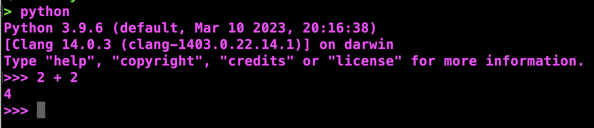
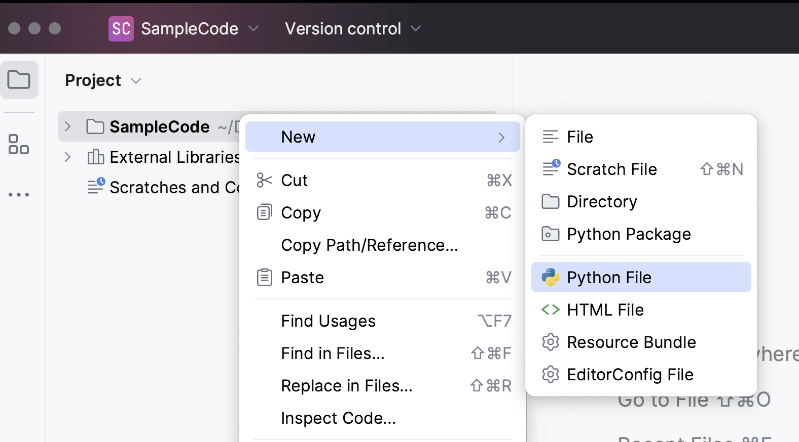
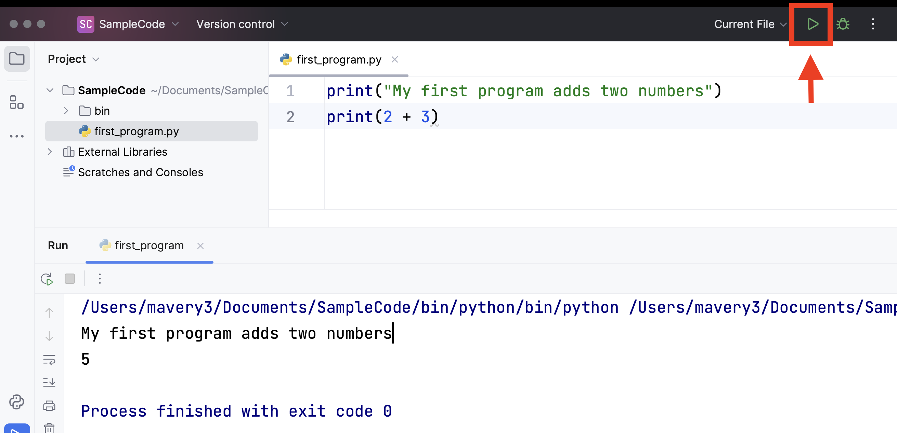

<style>
mark {
    color:#2babb2;
    font-weight: bold;
    background-color: white
}

span {
    color: white;
    font-weight: 600;
    background-color: #8351bc; 
    padding-left: 5px;
    padding-right: 5px;
    padding-top: 2px;
    padding-bottom: 2px;
    border-radius: 5px;
}

.python {
    background-color: #ecedee;
    color: black;
    padding: 5px 10px;
    font-weight: 500;
    border-radius: 5px;
    font-size: 14px;
}


str {
    color: #8159b1;
}

lit {
    color: #00bd20;
}

vari {
    color: #049be7;
}

keyword {
    color: #f00093;
}

func {
    color: #08afad;
}

comment {
    color: #91918d;
}
</style>

# Chapter 1: The Way of the Program

(Watch a video based on this chapter **PLACEHOLDER**.)
<br><br>
The goal of this book is to teach you to think like a computer scientist. This way of thinking combines some of the best features of mathematics, engineering, and natural science. Like mathematicians, computer scientists use formal languages to denote ideas (specifically computations). Like engineers, they design things, assembling components into systems and evaluating tradeoffs among alternatives. Like scientists, they observe the behavior of complex systems, form hypotheses, and test predictions.
<br><br>
The single most important skill for a computer scientist is <span>problem solving</span>. Problem solving means the ability to formulate problems, think creatively about solutions, and express a solution clearly and accurately. As it turns out, the process of learning to program is an excellent opportunity to practice problem-solving skills. That’s why this chapter is called, The way of the program.
<br><br>
On one level, you will be learning to program, a useful skill by itself. On another level, you will use programming as a means to an end. As we go along, that end will become clearer.
<br>
<br>
<hr>
<br>

## 1.0 🤖 Chapter Summary 
*Curtesy of ChatGPT*
<br><br>
Chapter 1 of the book introduces the reader to the programming mindset, emphasizing problem-solving skills as fundamental for a computer scientist. The programming language used is Python, a high-level language known for its readability and portability. The chapter covers the basics of Python, including the Python interpreter, immediate and script modes, and debugging.
<br><br>
The concept of a program is introduced as a sequence of instructions for computation, and the three types of programming errors (syntax, runtime, and semantic) are discussed. Debugging is likened to detective work and experimental science, emphasizing the importance of the process in programming.
<br><br>
The chapter concludes with a discussion on formal and natural languages, highlighting their differences, and presents the traditional "Hello, World!" program in Python. Comments in code, their importance, and syntax are also introduced. The glossary provides definitions for key programming terms, and exercises are provided to reinforce understanding.
<br>
<br>
<hr>
<br>

## 1.1 🐍 The Python Programming Language

The programming language you will be learning is Python. Python is an example of a high-level language; other <span>high-level languages</span> you might have heard of are C++, PHP, Pascal, C#, and Java.
<br><br>
As you might infer from the name high-level language, there are also <span>low-level languages</span>, sometimes referred to as machine languages or assembly languages. Loosely speaking, computers can only execute programs written in low-level languages. Thus, programs written in a high-level language have to be translated into something more suitable before they can run.
<br><br>
Almost all programs are written in high-level languages because of their advantages. It is much easier to program in a high-level language so programs take less time to write, they are shorter and easier to read, and they are more likely to be correct. Second, high-level languages are <span>portable</span>, meaning that they can run on different kinds of computers with few or no modifications.
<br><br>
In this sub edition of the textbook, we use an downloaded integrated devlopment environment (IDE) call PyCharm. To get started you'll need to download the Python programming language onto your computer. You can do so **[here](https://www.python.org/downloads)**, make sure you are downloading for the correct operating system. You'll then need to download the *community* version of Pycharm **[here](https://www.jetbrains.com/pycharm/download)**. 

The engine that translates and runs Python is called the <span>Python Interpreter</span>: There are two ways to use it: *immediate mode* and *script mode*. In immediate mode, you type Python expressions into the Python Interpreter window (in your terminal or command prompt), and the interpreter immediately shows the result:



The `>>>` or `>` is called the <span>Python prompt</span>. The interpreter uses the prompt to indicate that it is ready for instructions. We typed `2 + 2`, and the interpreter evaluated our expression, and replied `4`, and on the next line it gave a new prompt, indicating that it is ready for more input.
<br><br>
Working directly in the interpreter is convenient for testing short bits of code because you get immediate feedback. Think of it as scratch paper used to help you work out problems. Anything longer than a few lines should be put into a script. Scripts have the advantage that they can be saved to disk, printed, and so on. To create a project **WIP**
<br><br>
To create a script, you click the buttons in PyCharm as shown below.




To execute the program, click the <span>Run</span> button in the top right corner, the indicated green triangle. Make sure that "Current file" is selected in the dropdown to the left before you hit play. You're now a computer programmer! Let's take a look at some more theory before we start writing more advanced programs.


<br>
<br>
<hr>
<br>

## 1.2 🤔 What is a program?

A <span>program</span> is a sequence of instructions that specifies how to perform a computation. The computation might be something mathematical, such as solving a system of equations or finding the roots of a polynomial, but it can also be a symbolic computation, such as searching and replacing text in a document or (strangely enough) compiling a program.
<br><br>
The details look different in different languages, but a few basic instructions appear in just about every language:
<br><br>
<span>input</span>\
 from the keyboard, a file, or some other device.
<br><br>
<span>output</span>\
Display data on the screen or send data to a file or other device.
<br><br>
<span>math</span>\
Perform basic mathematical operations like addition and multiplication.
<br><br>
<span>conditional execution</span>\
Check for certain conditions and execute the appropriate sequence of statements.
<br><br>
<span>repetition</span>\
Perform some action repeatedly, usually with some variation.
<br><br>
Believe it or not, that’s pretty much all there is to it. Every program you’ve ever used, no matter how complicated, is made up of instructions that look more or less like these. Thus, we can describe programming as the process of breaking a large, complex task into smaller and smaller subtasks until the subtasks are simple enough to be performed with sequences of these basic instructions.
<br><br>
That may be a little vague, but we will come back to this topic later when we talk about <span>algorithms</span>.
<br>
<br>
<hr>
<br>

## 1.3. 🕵🏼 What is debugging?

"Being the detective in a crime movie in which you are also the murderer."
<br><br>
Programming is a complex process, and because it is done by human beings, it often leads to errors. Programming errors are called <span>bugs</span> and the process of tracking them down and correcting them is called <span>debugging</span>. Use of the term bug to describe small engineering difficulties dates back to at least 1889, when Thomas Edison had a bug with his phonograph.
<br><br>
Three kinds of errors can occur in a program: [syntax errors](https://en.wikipedia.org/wiki/Syntax_error), [runtime errors](https://en.wikipedia.org/wiki/Runtime_(program_lifecycle_phase)), and [semantic errors](https://en.wikipedia.org/wiki/Logic_error). It is useful to distinguish between them in order to track them down more quickly.
<br>
<br>
<hr>
<br>

## 1.4 🚫 Syntax Errors

Python can only execute a program if the program is syntactically correct; otherwise, the process fails and returns an error message. <span>Syntax</span> refers to the structure of a program and the rules about that structure. For example, in English, a sentence must begin with a capital letter and end with a period. this sentence contains a <span>syntax error</span>. So does this one
<br><br>
For most readers, a few syntax errors are not a significant problem, which is why we can read the poetry of E. E. Cummings without problems. Python is not so forgiving. If there is a single syntax error anywhere in your program, Python will display an error message and quit, and you will not be able to run your program. During the first few weeks of your programming career, you will probably spend a lot of time tracking down syntax errors. As you gain experience, though, you will make fewer errors and find them faster.
<br>
<br>
<hr>
<br>

## 1.5 🏃🏼‍♀️ Runtime Errors

The second type of error is a runtime error, so called because the error does not appear until you run the program. These errors are also called <span>exceptions</span> because they usually indicate that something exceptional (and bad) has happened.
<br><br>
Runtime errors are rare in the simple programs you will see in the first few chapters, so it might be a while before you encounter one.
<br>
<br>
<hr>
<br>

## 1.6 🤦🏻‍♀️ Semantic Errors

The third type of error is the <span>semantic error</span>. If there is a semantic error in your program, it will run successfully, in the sense that the computer will not generate any error messages, but it will not do the right thing. It will do something else. Specifically, it will do what you told it to do.
<br><br>
The problem is that the program you wrote is not the program you wanted to write. The meaning of the program (its semantics) is wrong. Identifying semantic errors can be tricky because it requires you to work backward by looking at the output of the program and trying to figure out what it is doing.
<br>
<br>
<hr>
<br>

## 1.7 🐞 Experimental Debugging

One of the most important skills you will acquire is debugging. Although it can be frustrating, debugging is one of the most intellectually rich, challenging, and interesting parts of programming.
<br><br>
In some ways, debugging is like detective work. You are confronted with clues, and you have to infer the processes and events that led to the results you see.
<br><br>
Debugging is also like an experimental science. Once you have an idea what is going wrong, you modify your program and try again. If your hypothesis was correct, then you can predict the result of the modification, and you take a step closer to a working program. If your hypothesis was wrong, you have to come up with a new one. As Sherlock Holmes pointed out, When you have eliminated the impossible, whatever remains, however improbable, must be the truth. (A. Conan Doyle, *The Sign of Four*)
<br><br>
For some people, programming and debugging are the same thing. That is, programming is the process of gradually debugging a program until it does what you want. The idea is that you should start with a program that does something and make small modifications, debugging them as you go, so that you always have a working program.
<br><br>
For example, Linux is an operating system kernel that contains millions of lines of code, but it started out as a simple program Linus Torvalds used to explore the Intel 80386 chip. According to Larry Greenfield, one of Linus’s earlier projects was a program that would switch between displaying AAAA and BBBB. This later evolved to Linux (*The Linux Users’ Guide* Beta Version 1).
<br><br>
Later chapters will make more suggestions about debugging and other programming practices.
<br>
<br>
<br>
<hr>
<br>

## 1.8 🗒️ Formal vs. Natural Languages

<span>Natural languages</span> are the languages that people speak, such as English, Spanish, and French. They were not designed by people (although people try to impose some order on them); they evolved naturally.
<br><br>
<span>Formal languages</span> are languages that are designed by people for specific applications. For example, the notation that mathematicians use is a formal language that is particularly good at denoting relationships among numbers and symbols. Chemists use a formal language to represent the chemical structure of molecules. And most importantly:
<br><br>
*Programming languages are formal languages that have been designed to express computations.*
<br><br>
Formal languages tend to have strict rules about syntax. For example, <mark>3 + 3 = 6</mark> is a syntactically correct mathematical statement, but <mark>3 =+ 6$</mark> is not. <mark>H2O</mark> is a syntactically correct chemical name, but <mark>2Zz</mark> is not.
<br><br>
Syntax rules come in two flavors, pertaining to </span>tokens</span> and structure. Tokens are the basic elements of the language, such as words, numbers, parentheses, commas, and so on. In Python, a statement like <mark>print("Happy New Year for ", 2013)</mark> has 6 tokens: a function name, an open parenthesis (round bracket), a string, a comma, a number, and a close parenthesis.
<br><br>
It is possible to make errors in the way one constructs tokens. One of the problems with <mark>3 =+ 6$</mark> is that <mark>$</mark> is not a legal token in mathematics (at least as far as we know). Similarly, <mark>2Zz</mark> is not a legal token in chemistry notation because there is no element with the abbreviation <mark>Zz</mark>.
<br><br>
The second type of syntax rule pertains to the <span>structure</span> of a statement— that is, the way the tokens are arranged. The statement 3=+6$ is structurally illegal because you can’t place a plus sign immediately after an equal sign. Similarly, molecular formulas have to have subscripts after the element name, not before. And in our Python example, if we omitted the comma, or if we changed the two parentheses around to say <mark>print) "Happy New Year for ", 2013(</mark> our statement would still have six legal and valid tokens, but the structure is illegal.
<br><br>
When you read a sentence in English or a statement in a formal language, you have to figure out what the structure of the sentence is (although in a natural language you do this subconsciously). This process is called 
<span>parsing</span>.
<br><br>
For example, when you hear the sentence, “The other shoe fell”, you understand that the other shoe is the subject and fell is the verb. Once you have parsed a sentence, you can figure out what it means, or the <span>semantics</span> of the sentence. Assuming that you know what a shoe is and what it means to fall, you will understand the general implication of this sentence.
<br><br>
Although formal and natural languages have many features in common — tokens, structure, syntax, and semantics — there are many differences:
<br><br>
<span>ambiguity</span>\
Natural languages are full of ambiguity, which people deal with by using contextual clues and other information. Formal languages are designed to be nearly or completely unambiguous, which means that any statement has exactly one meaning, regardless of context.
<br><br>
<span>redundancy</span>\
In order to make up for ambiguity and reduce misunderstandings, natural languages employ lots of redundancy. As a result, they are often verbose. Formal languages are less redundant and more concise.
<br><br>
<span>literalness</span>\
Formal languages mean exactly what they say. On the other hand, natural languages are full of idiom and metaphor. If someone says, “The other shoe fell”, there is probably no shoe and nothing falling. You’ll need to find the original joke to understand the idiomatic meaning of the other shoe falling. Yahoo! Answers thinks it knows!
<br><br>
People who grow up speaking a natural language—everyone—often have a hard time adjusting to formal languages. In some ways, the difference between formal and natural language is like the difference between poetry and prose, but more so:
<br><br>
<span>poetry</span>\
Words are used for their sounds as well as for their meaning, and the whole poem together creates an effect or emotional response. Ambiguity is not only common but often deliberate.
<br><br>
<span>prose</span>\
The literal meaning of words is more important, and the structure contributes more meaning. Prose is more amenable to analysis than poetry but still often ambiguous.
<br><br>
<span>program</span>\
The meaning of a computer program is unambiguous and literal, and can be understood entirely by analysis of the tokens and structure.
<br><br>
Here are some suggestions for reading programs (and other formal languages). First, remember that formal languages are much more dense than natural languages, so it takes longer to read them. Also, the structure is very important, so it is usually not a good idea to read from top to bottom, left to right. Instead, learn to parse the program in your head, identifying the tokens and interpreting the structure. Finally, the details matter. Little things like spelling errors and bad punctuation, which you can get away with in natural languages, can make a big difference in a formal language.
<br>
<br>
<hr>
<br>

## 1.9 🥳 The First Program

Traditionally, the first program written in a new language is called Hello, World! because all it does is display the words, Hello, World! In Python, the script looks like this: (For scripts, we’ll show line numbers to the left of the Python statements.)
<br><br>
<div class="python">
<func>print</func>(<str>"Hello, World!"</str>)
</div>
<br>
This is an example of using the <span>print function</span>, which doesn’t actually print anything on paper. It displays a value on the screen. In this case, the result shown is:
<br><br>
<div class="python">
Hello, World!
</div>
<br>
The quotation marks in the program mark the beginning and end of the value; they don’t appear in the result.

Some people judge the quality of a programming language by the simplicity of the Hello, World! program. By this standard, Python does about as well as possible.
<br>
<br>
<hr>
<br>

## 1.10 💬 Comments

As programs get bigger and more complicated, they get more difficult to read. Formal languages are dense, and it is often difficult to look at a piece of code and figure out what it is doing, or why.
<br><br>
For this reason, it is a good idea to add notes to your programs to explain in natural language what the program is doing.
<br><br>
A <span>comment</span> in a computer program is text that is intended only for the human reader — it is completely ignored by the interpreter.
<br><br>
In Python, the <mark>#</mark> token starts a comment. The rest of the line is ignored. Here is a new version of Hello, World!.
<br><br>
<div class="python">
<comment>#---------------------------------------------------<br>
# This demo program shows off how elegant Python is!<br>
# Written by Joe Soap, December 2010.<br>
# Anyone may freely copy or modify this program.<br>
#---------------------------------------------------</comment>

<func>print</func>(<str>"Hello, World!"</str>)&emsp;&emsp;<comment># 🥳 A great start!</comment>
</div>
<br>
You’ll also notice that we’ve left a blank line in the program. Blank lines are also ignored by the interpreter, but comments and blank lines can make your programs much easier for humans to parse. Use them liberally!
<br>
<br>
<hr>
<br>

## 1.11 📖 Glossary

<span>algorithm</span>\
A set of specific steps for solving a category of problems.
<br><br>
<span>bug</span>\
An error in a program.
<br><br>
<span>comment</span>\
Information in a program that is meant for other programmers (or anyone reading the source code) and has no effect on the execution of the program.
<br><br>
<span>debugging</span>\
The process of finding and removing any of the three kinds of programming errors.
<br><br>
<span>exception</span>\
Another name for a runtime error.
<br><br>
<span>formal language</span>\
Any one of the languages that people have designed for specific purposes, such as representing mathematical ideas or computer programs; all programming languages are formal 
languages.
<br><br>
<span>high-level language</span>\
A programming language like Python that is designed to be easy for humans to read and write.
<br><br>
<span>immediate mode</span>\
A style of using Python where we type expressions at the command prompt, and the results are shown immediately. Contrast with script, and see the entry under Python shell.
<br><br>
<span>interpreter</span>\
The engine that executes your Python scripts or expressions.
<br><br>
<span>low-level language</span>\
A programming language that is designed to be easy for a computer to execute; also called machine language or assembly language.
<br><br>
<span>natural language</span>\
Any one of the languages that people speak that evolved naturally.
<br><br>
<span>object code</span>\
The output of the compiler after it translates the program.
<br><br>
<span>parse</span>\
To examine a program and analyze the syntactic structure.
<br><br>
<span>portability</span>\
A property of a program that can run on more than one kind of computer.
<br><br>
<span>print function</span>\
A function used in a program or script that causes the Python interpreter to display a value on its output device.
<br><br>
<span>problem solving</span>\
The process of formulating a problem, finding a solution, and expressing the solution.
<br><br>
<span>program</span>\
a sequence of instructions that specifies to a computer actions and computations to be performed.
<br><br>
<span>Python shell</span>\
An interactive user interface to the Python interpreter. The user of a Python shell types commands at the prompt (>>>), and presses the return key to send these commands immediately to the interpreter for processing. The word shell comes from Unix. In the PyScripter used in this RLE version of the book, the Interpreter Window is where we’d do the immediate mode interaction.
<br><br>
<span>runtime error</span>\
An error that does not occur until the program has started to execute but that prevents the program from continuing.
<br><br>
<span>script</span>\
A program stored in a file (usually one that will be interpreted).
<br><br>
<span>semantic error</span>\
An error in a program that makes it do something other than what the programmer intended.
<br><br>
<span>semantics</span>\
The meaning of a program.
<br><br>
<span>source code</span>\
A program in a high-level language before being compiled.
<br><br>
<span>syntax</span>\
The structure of a program.
<br><br>
<span>syntax error</span>\
An error in a program that makes it impossible to parse — and therefore impossible to interpret.
<br><br>
<span>token</span>\
One of the basic elements of the syntactic structure of a program, analogous to a word in a natural language.
<br>
<br>
<hr>
<br>

## 1.12 🏋🏿 Exercises

1. Write an English sentence with understandable semantics but incorrect syntax. Write another English sentence which has correct syntax but has semantic errors.

2. Using the Python interpreter, type `1 + 2` and then hit return. Python evaluates this expression, displays the result, and then shows another prompt. `*` is the multiplication operator, and `**` is the exponentiation operator. Experiment by entering different expressions and recording what is displayed by the Python interpreter.

3. Type `1 2` and then hit return. Python tries to evaluate the expression, but it can’t because the expression is not syntactically legal. Instead, it shows the error message:

    ```python
    File "<interactive input>", line 1
        1 2
          ^
    SyntaxError: invalid syntax
    ```

    In many cases, Python indicates where the syntax error occurred, but it is not always right, and it doesn’t give you much information about what is wrong.

    So, for the most part, the burden is on you to learn the syntax rules.

    In this case, Python is complaining because there is no operator between the numbers.

    See if you can find a few more examples of things that will produce error messages when you enter them at the Python prompt. Write down what you enter at the prompt and the last line of the error message that Python reports back to you.

4. Type `print("hello")`. Python executes this, which has the effect of printing the letters h-e-l-l-o. Notice that the quotation marks that you used to enclose the string are not part of the output. Now type `"hello"` and describe your result. Make notes of when you see the quotation marks and when you don’t.

5. Type cheese without the quotation marks. The output will look something like this:

    ```python
    Traceback (most recent call last):
      File "<interactive input>", line 1, in ?
    NameError: name 'cheese' is not defined
    ```

    This is a run-time error; specifically, it is a NameError, and even more specifically, it is an error because the name cheese is not defined. If you don’t know what that means yet, you will soon.

6. Type 6 + 4 * 9 at the Python prompt and hit enter. Record what happens.

    Now create a Python script with the following contents:

    ```python
    6 + 4 * 9
    ```

    What happens when you run this script? Now change the script contents to:


    ```python
    print(6 + 4 * 9)
    ```
    and run it again.

    What happened this time?
<br><br>
    Whenever an expression is typed at the Python prompt, it is evaluated and the result is automatically shown on the line below. (Like on your calculator, if you type this expression you’ll get the result 42.)
<br><br>
    A script is different, however. Evaluations of expressions are not automatically displayed, so it is necessary to use the <span>print</span> function to make the answer show up.
<br><br>
    It is hardly ever necessary to use the print function in immediate mode at the command prompt.
