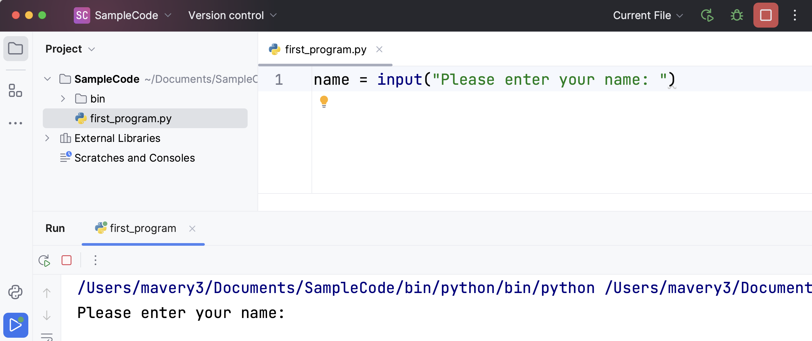

# Chapter 2: Variables, Expressions and Statements

(Watch a video based on this chapter **PLACE_HOLDER**.)
 
 

 

## 2.1. Values and Data Types

A **value** is one of the fundamental things — like a letter or a number — that a program manipulates. The values we have seen so far are <mark>4</mark> (the result when we added <mark>2 + 2</mark>), and <mark>"Hello, World!"</mark>.
  
These values are classified into different **classes**, or **data types**: <mark>4</mark> is an *integer*, and <mark>"Hello, World!"</mark> is a *string*, so-called because it contains a string of letters. You (and the interpreter) can identify strings because they are enclosed in quotation marks.
  
If you are not sure what class a value falls into, Python has a function called **type** which can tell you.\
 

<tick>&gt;&gt;&gt;</tick><func>type</func>(<str>"Hello, World!"</str>) 
 <output>&lt;class 'str'&gt;   </output>
<tick>&gt;&gt;&gt;</tick><func>type</func>(<lit>17</lit>) 
 <output>&lt;class 'int'&gt; </output>

 

Not surprisingly, strings belong to the class **str** and integers belong to the class **int**. Less obviously, numbers with a decimal point belong to a class called **float**, because these numbers are represented in a format called *floating-point*. At this stage, you can treat the words *class* and *type* interchangeably. We’ll come back to a deeper understanding of what a class is in later chapters.

<tick>&gt;&gt;&gt;</tick><func>type</func>(<lit>3.2</lit>) 
 <output>&lt;class 'float'&gt; </output>

What about values like <mark>"17"</mark> and <mark>"3.2"</mark>? They look like numbers, but they are in quotation marks like strings.

<tick>&gt;&gt;&gt;</tick><func>type</func>(<str>"17"</str>) 
 <output>&lt;class 'str'&gt; </output>
  
<tick>&gt;&gt;&gt;</tick><func>type</func>(<str>"3.2"</str>) 
 <output>&lt;class 'str'&gt; </output>

They’re strings!
  
Strings in Python can be enclosed in either single quotes (') or double quotes ("), or three of each (''' or """)

<tick>&gt;&gt;&gt;</tick><func>type</func>(<str>'This is a string.'</str>) 
 <output>&lt;class 'str'&gt; </output>
  
<tick>&gt;&gt;&gt;</tick><func>type</func>(<str>"And so is this."</str>) 
 <output>&lt;class 'str'&gt; </output>
  
<tick>&gt;&gt;&gt;</tick><func>type</func>(<str>"""and this."""</str>) 
 <output>&lt;class 'str'&gt; </output>
  
<tick>&gt;&gt;&gt;</tick><func>type</func>(<str>'''and even this...'''</str>) 
 <output>&lt;class 'str'&gt; </output>

Double quoted strings can contain single quotes inside them, as in <mark>"Bruce's beard"</mark>, and single quoted strings can have double quotes inside them, as in <mark>'The knights who say "Ni!"'</mark>.
  
Strings enclosed with three occurrences of either quote symbol are called triple quoted strings. They can contain either single or double quotes:

<tick>&gt;&gt;&gt;</tick><func>print</func>(<str>'''"Oh no", she exclaimed, "Ben's bike is broken!"'''</str>) 
 <output>"Oh no", she exclaimed, "Ben's bike is broken!" </output>

 
Triple quoted strings can even span multiple lines:
  

<tick>&gt;&gt;&gt;</tick>message = <str>"""This message will
... span several
... lines."""</str>
  
<tick>&gt;&gt;&gt;</tick><func>print</func>(message)
 
 <output>This message will 
span several 
lines. </output>

 
Python doesn’t care whether you use single or double quotes or the three-of-a-kind quotes to surround your strings: once it has parsed the text of your program or command, the way it stores the value is identical in all cases, and the surrounding quotes are not part of the value. But when the interpreter wants to display a string, it has to decide which quotes to use to make it look like a string.
  

<tick>&gt;&gt;&gt;</tick><str>'This is a string.'</str> 
 <output>'This is a string.' </output>
  
<tick>&gt;&gt;&gt;</tick><str>"""And so is this."""</str> 
 <output>'And so is this.' </output>

 
So the Python language designers usually chose to surround their strings by single quotes. What do you think would happen if the string already contained single quotes?
  
When you type a large integer, you might be tempted to use commas between groups of three digits, as in <mark>42,000</mark>. This is not a legal integer in Python, but it does mean something else, which is legal:
  

<tick>&gt;&gt;&gt;</tick><lit>42000</lit> 
 <output>42000 </output>
  
<tick>&gt;&gt;&gt;</tick><lit>42,000</lit> 
 <output>(42, 0) <output>

 
Well, that’s not what we expected at all! Because of the comma, Python chose to treat this as a pair of values. We’ll come back to learn about pairs later. But, for the moment, remember not to put commas or spaces in your integers, no matter how big they are. Also revisit what we said in the previous chapter: formal languages are strict, the notation is concise, and even the smallest change might mean something quite different from what you intended.
 
 

 

## 2.2. Variables

One of the most powerful features of a programming language is the ability to manipulate **variables**. A variable is a name that refers to a value.
  
The **assignment statement** gives a value to a variable:
  

<tick>&gt;&gt;&gt;</tick>message = <str>"What's up, Doc? 🥕🐇"</str>
  
<tick>&gt;&gt;&gt;</tick>age = <lit>17</lit>
  
<tick>&gt;&gt;&gt;</tick>pi = <lit>3.14159</lit>

 
This example makes three assignments. The first assigns the string value <mark>"What's up, Doc? 🥕🐇"</mark> to a variable named message. The second gives the integer <mark>17</mark> to <mark>age</mark>, and the third assigns the floating-point number <mark>3.14159</mark> to a variable called <mark>pi</mark>.
  
The assignment token, <mark>=</mark>, should not be confused with *equals*, which uses the token <mark>==</mark>. The assignment statement binds a *name*, on the left-hand side of the operator, to a *value*, on the right-hand side. This is why you will get an error if you enter:
  

<tick>&gt;&gt;&gt;</tick><lit>17</lit> = num 
<error>File " &lt;stdin&gt;", line 1
SyntaxError: can't assign to literal

</error>
 

💡 <b>Helpful Tip</b>
 
When reading or writing code, say to yourself “n is assigned 17” or “n gets the value 17”. Don’t say “n equals 17”.

 

A common way to represent variables on paper is to write the name with an arrow pointing to the variable’s value. This kind of figure is called a **state snapshot** because it shows what state each of the variables is in at a particular instant in time. (Think of it as the variable’s state of mind). This diagram shows the result of executing the assignment statements:
  

<b>message</b> &#8594; "What's up, Doc?" 
&nbsp;&nbsp;&nbsp;&nbsp;&nbsp;&nbsp;&nbsp;&nbsp;&nbsp;&nbsp;<b>age</b> &#8594; 17
 
&nbsp;&nbsp;&nbsp;&nbsp;&nbsp;&nbsp;&nbsp;&nbsp;&nbsp;&nbsp;&nbsp;&nbsp;&nbsp;<b>pi</b> &#8594; 4.14159

 
If you ask the interpreter to evaluate a variable, it will produce the value that is currently linked to the variable:
  

<tick>&gt;&gt;&gt;</tick>message 
 <output>"What's up, Doc? 🥕🐇" </output>
  
<tick>&gt;&gt;&gt;</tick> n 
 <output>17 </output>
  
<tick>&gt;&gt;&gt;</tick> pi 
 <output>3.14159 </output>

 
We use variables in a program to “remember” things, perhaps the current score at the football game. But variables are *variable*. This means they can change over time, just like the scoreboard at a football game. You can assign a value to a variable, and later assign a different value to the same variable. (*This is different from math. In math, if you give <mark>x</mark> the value <mark>3</mark>, it cannot change to link to a different value half-way through your calculations!*)
  

<tick>&gt;&gt;&gt;</tick> day = <str>"Thursday"</str>
  
<tick>&gt;&gt;&gt;</tick> day 
 <output>'Thursday' </output>
  
<tick>&gt;&gt;&gt;</tick> day = <str>"Friday"</str>
  
<tick>&gt;&gt;&gt;</tick> day 
 <output>'Friday' </output>
  
<tick>&gt;&gt;&gt;</tick> day = <lit>21</lit>
  
<tick>&gt;&gt;&gt;</tick> day 
 <output>21 </output>

 
You’ll notice we changed the value of <mark>day</mark> three times, and on the third assignment we even made it refer to a value that was of a different type.
  
A great deal of programming is about having the computer remember things, e.g. *The number of missed calls on your phone*, and then arranging to update or change the variable when you miss another call.
 
 

 

## 2.3. Variable Names and Keywords

**Variable names** can be arbitrarily long. They can contain both letters and digits, but they have to begin with a letter or an underscore. Although it is legal to use uppercase letters, by convention we don’t. If you do, remember that case matters. <mark>Bruce</mark> and <mark>bruce</mark> are different variables.
  
The underscore character ( _) can appear in a name. It is often used in names with multiple words, such as <mark>my_name</mark> or <mark>price_of_tea_in_china</mark>.
  
There are some situations in which names beginning with an underscore have special meaning, so a safe rule for beginners is to start all names with a letter.
  
If you give a variable an illegal name, you get a syntax error:
  

<tick>&gt;&gt;&gt;</tick> 76trombones = <str>"big parade"</str> 
<error>SyntaxError: invalid syntax</error>
  
<tick>&gt;&gt;&gt;</tick> more$ = <lit>1000000</lit> 
<error>SyntaxError: invalid syntax</error>
  
<tick>&gt;&gt;&gt;</tick> class</vair> = <str>"Computer Science 101"</str>
 
<error>SyntaxError: invalid syntax</error>

 
<mark>76trombones</mark> is illegal because it does not begin with a letter. <mark>more$</mark> is illegal because it contains an illegal character, the dollar sign. But what’s wrong with <mark>class</mark>?
  
It turns out that <mark>class</mark> is one of the Python **keywords**. Keywords define the language’s syntax rules and structure, and they cannot be used as variable names.
  
Python has thirty-something keywords (and every now and again improvements to Python introduce or eliminate one or two):
  
 <output>
    <table>
        <tr>
            <td>and</td>
            <td>as</td>
            <td>assert</td>
            <td>break</td>
            <td>class</td>
            <td>continue</td>
        <tr>
        <tr>
            <td>def</td>
            <td>del</td>
            <td>elif</td>
            <td>else</td>
            <td>except</td>
            <td>exec</td>
        <tr>
        <tr>
            <td>finally</td>
            <td>for</td>
            <td>from</td>
            <td>global</td>
            <td>if</td>
            <td>import</td>
        <tr>
        <tr>
            <td>in</td>
            <td>is</td>
            <td>lambda</td>
            <td>nonlocal</td>
            <td>not</td>
            <td>or</td>
        <tr>
        <tr>
            <td>pass</td>
            <td>raise</td>
            <td>return</td>
            <td>try</td>
            <td>while</td>
            <td>with</td>
        <tr>
        <tr>
            <td>yield</td>
            <td>True</td>
            <td>False</td>
            <td>None</td>
        <tr>
    </table>
 </output>
 
You might want to keep this list handy. If the interpreter complains about one of your variable names and you don’t know why, see if it is on this list.
  
Programmers generally choose names for their variables that are meaningful to the human readers of the program — they help the programmer document, or remember, what the variable is used for.
  

🚨 <b>Careful!</b>
 
Beginners sometimes confuse “meaningful to the human readers” with “meaningful to the computer”. So they’ll wrongly think that because they’ve called some variable <mark>average</mark> or <mark>pi</mark>, it will somehow magically calculate an average, or magically know that the variable <mark>pi</mark> should have a value like <mark>3.14159</mark>. No! The computer doesn’t understand what you intend the variable to mean.
  
So you’ll find some instructors who deliberately don’t choose meaningful names when they teach beginners — not because we don’t think it is a good habit, but because we’re trying to reinforce the message that you — the programmer — must write the program code to calculate the average, and you must write an assignment statement to give the variable <mark>pi</mark> the value you want it to have.

 
 

 

## 2.4. 📝 Statements

A **statement** is an instruction that the Python interpreter can execute. We have only seen the assignment statement so far. Some other kinds of statements that we’ll see shortly are <mark>while</mark> statements, <mark>for</mark> statements, <mark>if</mark> statements, and <mark>import</mark> statements. (There are other kinds too!)
  
When you type a statement on the command line, Python executes it. Statements don’t produce any result.
 
 

 

## 2.5. Evaluating Expressions

An **expression** is a combination of values, variables, operators, and calls to functions. If you type an expression at the Python prompt, the interpreter **evaluates** it and displays the result:
  

<tick>&gt;&gt;&gt;</tick> <lit>1</lit> + <lit>1</lit> 
 <output>2 </output>
  
<tick>&gt;&gt;&gt;</tick> <func>len</func>(<str>"hello"</str>) 
 <output>5 </output>

 
In this example <mark>len</mark> is a built-in Python function that returns the number of characters in a <mark>string</mark>. We’ve previously seen the <mark>print</mark> and the <mark>type</mark> functions, so this is our third example of a function!
  
The *evaluation* of an *expression* produces a value, which is why expressions can appear on the right hand side of assignment statements. A value all by itself is a simple expression, and so is a variable.
  

<tick>&gt;&gt;&gt;</tick> <lit>17</lit> 
 <output>17 </output>
  
<tick>&gt;&gt;&gt;</tick> y = <lit>3.14</lit>
  
<tick>&gt;&gt;&gt;</tick> x = <func>len</func>(<str>"hello"</str>)
  
<tick>&gt;&gt;&gt;</tick> x 
 <output>5 </output>
  
<tick>&gt;&gt;&gt;</tick> y 
 <output>3.14 </output>

 
## 2.6. Operators and Operands

**Operators** are special tokens that represent computations like addition, multiplication and division. The values the operator uses are called **operands**.
  
The following are all legal Python expressions whose meaning is more or less clear:
  

<lit>20</lit> + <lit>32</lit> 
hour - <lit>1</lit> 
hour * <lit>60</lit> + minute
 minute / <lit>60</lit>
 <lit>5</lit> ** <lit>2</lit>
 (<lit>5</lit> + <lit>9</lit>) * (<lit>15</lit> - <lit>7</lit>)

 
The tokens <mark>+</mark>, <mark>-</mark>, and <mark>*</mark>, and the use of parenthesis for grouping, mean in Python what they mean in mathematics. The asterisk (<mark>*</mark>) is the token for multiplication, and <mark>**</mark> is the token for exponentiation.
  

<tick>&gt;&gt;&gt;</tick> <lit>2</lit> ** <lit>3</lit> 
 <output>8 </output>
  
<tick>&gt;&gt;&gt;</tick> <lit>3</lit> ** <lit>2</lit> 
 <output>9 </output>

 
When a variable name appears in the place of an operand, it is replaced with its value before the operation is performed.
  
Addition, subtraction, multiplication, and exponentiation all do what you expect.
  
Example: so let us convert 645 minutes into hours:
  

<tick>&gt;&gt;&gt;</tick> minutes = <lit>645</lit>
  
<tick>&gt;&gt;&gt;</tick> hours = minutes / <lit>60</lit>
  
<tick>&gt;&gt;&gt;</tick> hours 
 <output>10.75 </output>

 
Oops! In Python 3, the division operator <mark>/</mark> always yields a floating point result. What we might have wanted to know was how many whole hours there are, and how many minutes remain. Python gives us two different flavors of the division operator. The second, called **floor division** uses the token <mark>//</mark>. Its result is always a whole number — and if it has to adjust the number it always moves it to the left on the number line. So <mark>6 // 4</mark> yields <mark>1</mark>, but <mark>-6 // 4</mark> might surprise you!
  

<tick>&gt;&gt;&gt;</tick> <lit>7</lit> / <lit>4</lit> 
 <output>1.75 </output>
  
<tick>&gt;&gt;&gt;</tick> <lit>7</lit> // <lit>4</lit> 
 <output>1 </output>
  
<tick>&gt;&gt;&gt;</tick> minutes = <lit>645</lit>
  
<tick>&gt;&gt;&gt;</tick> hours = minutes // <lit>60</lit>
  
<tick>&gt;&gt;&gt;</tick> hours 
 <output>10

 
 

 

Take care that you choose the correct flavor of the division operator. If you’re working with expressions where you need floating point values, use the division operator that does the division accurately.

## 2.7. Type Converter Functions

Here we’ll look at three more Python functions, <mark>int</mark>, <mark>float</mark> and <mark>str</mark>, which will (attempt to) convert their arguments into types <mark>int</mark>, <mark>float</mark> and <mark>str</mark> respectively. We call these **type converter** functions.
  
The int function can take a floating point number or a string, and turn it into an int. For floating point numbers, it discards the decimal portion of the number — a process we call truncation towards zero on the number line. Let us see this in action:
  

<tick>&gt;&gt;&gt;</tick> <func>int</func>(<lit>3.14</lit>) 
 <output>3 </output>
  
<tick>&gt;&gt;&gt;</tick> <func>int</func>(<lit>3.9999</lit>)             <comment># This doesn't round to the closest int!</comment> 
 <output>3 </output>
  
<tick>&gt;&gt;&gt;</tick> <func>int</func>(<lit>3.0</lit>) 
 <output>3 </output>
  
<tick>&gt;&gt;&gt;</tick> <func>int</func>(<lit>-3.999</lit>)             <comment># Note that the result is closer to zero </comment>
 <output>-3 </output>
  
<tick>&gt;&gt;&gt;</tick> <func>int</func>(minutes / <lit>60</lit>) 
 <output>10 </output>
  
<tick>&gt;&gt;&gt;</tick> <func>int</func>(<str>"2345"</str>)             <comment># Parse a string to produce an int</comment> 
 <output>2345 </output>
  
<tick>&gt;&gt;&gt;</tick> <func>int</func>(<lit>17</lit>)                 <comment># It even works if arg is already an int </comment>
 <output>17 </output>
  
<tick>&gt;&gt;&gt;</tick> <func>int</func>(<str>"23 bottles"</str>)

 
This last case doesn’t look like a number — what do we expect?
  

<error>Traceback (most recent call last):
File " &lt;stdin&gt;", line 1, in <module>
ValueError: invalid literal for int() with base 10: '23 bottles'</error>

 
The type converter <mark>float</mark> can turn an integer, a float, or a syntactically legal string into a float:
  

<tick>&gt;&gt;&gt;</tick> <func>float</func>(<lit>17</lit>) 
 <output>17.0 </output>
  
<tick>&gt;&gt;&gt;</tick> <func>float</func>(<str>"123.45"</str>) 
 <output>123.45 <output>

 
The type converter <mark>str</mark> turns its argument into a string:
  

<tick>&gt;&gt;&gt;</tick> <func>str</func>(<lit>17</lit>) 
 <output>'17' </output>
  
<tick>&gt;&gt;&gt;</tick> <func>str</func>(<lit>123.45</lit>) 
 <output>'123.45' </output>

 
 

 

## 2.8. Order of Operations

When more than one operator appears in an expression, the order of evaluation depends on the **rules of precedence**. Python follows the same precedence rules for its mathematical operators that mathematics does. The acronym PEMDAS is a useful way to remember the order of operations:
  
1. **P**arentheses have the highest precedence and can be used to force an expression to evaluate in the order you want. Since expressions in parentheses are evaluated first, <mark>2 * (3 - 1)</mark> is <mark>4</mark>, and <mark>(1 + 1) ** (5 - 2)</mark> is <mark>8</mark>. You can also use parentheses to make an expression easier to read, as in <mark>(minute * 100) / 60</mark>, even though it doesn’t change the result.

2. **E**xponentiation has the next highest precedence, so <mark>2 ** 1 + 1</mark> is <mark>3</mark> and not <mark>4</mark>, and <mark>3 * 1 ** 3</mark> is <mark>3</mark> and not <mark>27</mark>.

3. **M**ultiplication and both **D**ivision operators have the same precedence, which is higher than **A**ddition and **S**ubtraction, which also have the same precedence. So <mark>2 * 3 - 1</mark> yields <mark>5</mark> rather than <mark>4</mark>, and <mark>5 - 2 * 2</mark> is <mark>1</mark>, not <mark>6</mark>.
  
Operators with the same precedence are evaluated from left-to-right. In algebra we say they are left-associative. So in the expression <mark>6 - 3 + 2</mark>, the subtraction happens first, yielding <mark>3</mark>. We then add <mark>2</mark> to get the result <mark>5</mark>. If the operations had been evaluated from right to left, the result would have been <mark>6 - (3 + 2)</mark>, which is <mark>1</mark>. (The acronym PEDMAS could mislead you to thinking that division has higher precedence than multiplication, and addition is done ahead of subtraction - don’t be misled. Subtraction and addition are at the same precedence, and the left-to-right rule applies.)
  
Due to some historical quirk, an exception to the left-to-right left-associative rule is the exponentiation operator <mark>**</mark>, so a useful hint is to always use parentheses to force exactly the order you want when exponentiation is involved:
  

<tick>&gt;&gt;&gt;</tick> <lit>2</lit> ** <lit>3</lit> ** <lit>2</lit>&nbsp;&nbsp;&nbsp;&nbsp;&nbsp;&nbsp;&nbsp;&nbsp;&nbsp;&nbsp;&nbsp;&nbsp;<comment># The right-most ** operator gets done first!</comment> 
 <output>512 </output>
  
<tick>&gt;&gt;&gt;</tick> (<lit>2</lit> ** <lit>3</lit>) ** <lit>2</lit>&nbsp;&nbsp;&nbsp;&nbsp;&nbsp;&nbsp;&nbsp;&nbsp&nbsp;&nbsp;<comment># Use parentheses to force the order you want!</comment> 
 <output>64 </output>

 
The immediate mode command prompt of Python is great for exploring and experimenting with expressions like this.
 
 

 

## 2.9. Operations on Strings

In general, you cannot perform mathematical operations on strings, even if the strings look like numbers. The following are illegal (assuming that message has type string):
  

<tick>&gt;&gt;&gt;</tick> message - <lit>1</lit> 
<error>Traceback (most recent call last):
  File "&lt;stdin&gt;", line 1, in <module>
TypeError: unsupported operand type(s) for -: 'str' and 'int'</error>
  
<tick>&gt;&gt;&gt;</tick> <str>"Hello"</str> / <lit>123</lit> 
<error>Traceback (most recent call last):
  File "&lt;stdin&gt;", line 1, in <module>
TypeError: unsupported operand type(s) for /: 'str' and 'int'</error>
  
<tick>&gt;&gt;&gt;</tick> <var>message * <str>"Hello"</str> 
<error>Traceback (most recent call last):
  File "<stdin>", line 1, in <module>
TypeError: can't multiply sequence by non-int of type 'str'</error>
  
<tick>&gt;&gt;&gt;</tick> <str>"15"</str> + <lit>2</lit> 
<error>Traceback (most recent call last):
  File "<stdin>", line 1, in <module>
TypeError: can only concatenate str (not "int") to str</error>

 
Interestingly, the <mark>+</mark> operator does work with strings, but for strings, the <mark>+</mark> operator represents **concatenation**, not addition. Concatenation means joining the two operands by linking them end-to-end. For example:
  

fruit = <str>"banana"</str> 
baked_good = <str>" nut bread"</str>
  
<func>print</func>(fruit + baked_good)

 
The output of this program is banana nut bread. The space before the word nut is part of the string, and is necessary to produce the space between the concatenated strings.
  
The <mark>*</mark> operator also works on strings; it performs repetition. For example, <mark>'Fun' * 3</mark> is <mark>'FunFunFun'</mark>. One of the operands has to be a string; the other has to be an integer.
  
On one hand, this interpretation of <mark>+</mark> and <mark>*</mark> makes sense by analogy with addition and multiplication. Just as <mark>4 * 3</mark> is equivalent to <mark>4 + 4 + 4</mark>, we expect <mark>"Fun" * 3</mark> to be the same as <mark>"Fun" + "Fun" + "Fun"</mark>, and it is. On the other hand, there is a significant way in which string concatenation and repetition are different from integer addition and multiplication. Can you think of a property that addition and multiplication have that string concatenation and repetition do not?
 
 

 

## 2.10. Input

There is a built-in function in Python for getting input from the user:
  

name = <func>input</func>(<str>"Please enter your name: "</str>)

 
A sample run of this script in PyCharm, would populate your input question in the console to the bottom like this:

The user of the program can enter the name and press enter, and when this happens the text that has been entered is returned from the input function, and in this case assigned to the variable n.
  
Even if you asked the user to enter their age, you would get back a string like <mark>"17"</mark>. It would be your job, as the programmer, to convert that string into a int or a float, using the <mark>int</mark> or <mark>float</mark> converter functions we saw earlier.
 
 

 

## 2.11. Composition

So far, we have looked at the elements of a program — variables, expressions, statements, and function calls — in isolation, without talking about how to combine them.
  
One of the most useful features of programming languages is their ability to take small building blocks and **compose** them into larger chunks.
  
For example, we know how to get the user to enter some input, we know how to convert the string we get into a float, we know how to write a complex expression, and we know how to print values. Let’s put these together in a small four-step program that asks the user to input a value for the radius of a circle, and then computes the area of the circle from the formula

Firstly, we’ll do the four steps one at a time:
  

response = <func>input</func>(<str>"What is your radius? "</str>) 
radius = <func>float</func>(response) 
area = <lit>3.14159</lit> * (radius ** <lit>2</lit>)
  
<func>print</func>(<str>"The area is "</str>, area)

 
Now let’s compose the first two lines into a single line of code, and compose the second two lines into another line of code.
  

radius = <func>float</func>(<func>input</func>(<str>"What is your radius? "</str>))
  
<func>print</func>(<str>"The area is "</str>, <lit>3.14159</lit> * (radius ** <lit>2</lit>))

 
If we really wanted to be tricky, we could write it all in one statement:
  

<func>print</func>(<str>"The area is "</str>, <lit>3.14159</lit> * <func>float</func>(<func>input</func>(<str>"What is your radius?"</str>)) ** <lit>2</lit>)

 
Such compact code may not be most understandable for humans, but it does illustrate how we can compose bigger chunks from our building blocks.
  
If you’re ever in doubt about whether to compose code or fragment it into smaller steps, try to make it as simple as you can for the human to follow. My choice would be the first case above, with four separate steps.
 
 

 

## 2.12. The Modulus Operator

The modulus operator works on integers (and integer expressions) and gives the remainder when the first number is divided by the second. In Python, the modulus operator is a percent sign (<mark>%</mark>). The syntax is the same as for other operators. It has the same precedence as the multiplication operator.
  

<tick>&gt;&gt;&gt;</tick> q = <lit>7</lit> // <lit>3</lit>&nbsp;&nbsp;&nbsp;&nbsp;&nbsp;&nbsp;&nbsp;&nbsp;<comment># This is integer division operator</comment>
  
<tick>&gt;&gt;&gt;</tick> <func>print</func>(q) 
 <output>2 </output>
  
<tick>&gt;&gt;&gt;</tick> r  = <lit>7</lit> % <lit>3</lit>
  
<tick>&gt;&gt;&gt;</tick>print(r)
 <output>1 </output>

 
So <mark>7</mark> divided by <mark>3</mark> is <mark>2</mark> with a remainder of <mark>1</mark>.
  
The modulus operator turns out to be surprisingly useful. For example, you can check whether one number is divisible by another—if <mark>x % y</mark> is zero, then <mark>x</mark> is divisible by <mark>y</mark>.
  
Also, you can extract the right-most digit or digits from a number. For example, <mark>x % 10</mark> yields the right-most digit of <mark>x</mark> (in base <mark>10</mark>). Similarly <mark>x % 100</mark> yields the last two digits.
  
It is also extremely useful for doing conversions, say from seconds, to hours, minutes and seconds. So let’s write a program to ask the user to enter some seconds, and we’ll convert them into hours, minutes, and remaining seconds.
  

total_secs = <func>int</func>(<func>input</func>(<str>"How many seconds, in total?"</str>)) 
hours = total_secs // <lit>3600</lit> 
secs_still_remaining = total_secs % <lit>3600</lit> 
minutes =  secs_still_remaining // <lit>60</lit> 
secs_remaining = secs_still_remaining  % <lit>60</lit>
  
<func>print</func>(<str>"Hrs = "</str>, hours, <str>"  mins = "</str>, minutes, <str>"secs = "</str>, secs_remaining)

 
 

 

## 2.13. 📖 Glossary

assignment statement\
A statement that assigns a value to a name (variable). To the left of the assignment operator, <mark>=</mark>, is a name. To the right of the assignment token is an expression which is evaluated by the Python interpreter and then assigned to the name. The difference between the left and right hand sides of the assignment statement is often confusing to new programmers. In the following assignment:
  

n = n + <lit>1</lit>

 
<mark>n</mark> plays a very different role on each side of the <mark>=</mark>. On the right it is a value and makes up part of the expression which will be evaluated by the Python interpreter before assigning it to the name on the left.\
  

assignment token\
<mark>=</mark> is Python’s assignment token. Do not confuse it with *equals*, which is an operator for comparing values.\
 

composition\
The ability to combine simple expressions and statements into compound statements and expressions in order to represent complex computations concisely.\
 

concatenate\
To join two strings end-to-end.\
 

data type\
A set of values. The type of a value determines how it can be used in expressions. So far, the types you have seen are integers (<mark>int</mark>), floating-point numbers (<mark>float</mark>), and strings (<mark>str</mark>).\
 

evaluate\
To simplify an expression by performing the operations in order to yield a single value.\
 

expression\
A combination of variables, operators, and values that represents a single result value.\
 

float\
A Python data type which stores *floating-point* numbers. Floating-point numbers are stored internally in two parts: a *base* and an *exponent*. When printed in the standard format, they look like decimal numbers. Beware of rounding errors when you use <mark>floats</mark>, and remember that they are only approximate values.\
 

floor division\
An operator (denoted by the token <mark>//</mark>) that divides one number by another and yields an integer, or, if the result is not already an integer, it yields the next smallest integer.\
 

int\
A Python data type that holds positive and negative whole numbers.\
 

keyword\
A reserved word that is used by the compiler to parse programs; you cannot use keywords like <mark>if</mark>, <mark>def</mark>, and <mark>while</mark> as variable names.\
 

modulus operator\
An operator, denoted with a percent sign (<mark>%</mark>), that works on integers and yields the remainder when one number is divided by another.\
 

operand\
One of the values on which an operator operates.\
 

operator\
A special symbol that represents a simple computation like addition, multiplication, or string concatenation.\
 

rules of precedence\
The set of rules governing the order in which expressions involving multiple operators and operands are evaluated.\
 

state snapshot\
A graphical representation of a set of variables and the values to which they refer, taken at a particular instant during the program’s execution.\
 

statement\
An instruction that the Python interpreter can execute. So far we have only seen the assignment statement, but we will soon meet the <mark>import</mark> statement and the <mark>for</mark> statement.\
 

str\
A Python data type that holds a string of characters.\
 

value\
A number or string (or other things to be named later) that can be stored in a variable or computed in an expression.\
 

variable\
A name that refers to a value.\
 

variable name\
A name given to a variable. Variable names in Python consist of a sequence of letters (<mark>a..z</mark>, <mark>A..Z</mark>, and <mark>_</mark>) and digits (0..9) that begins with a letter. In best programming practice, variable names should be chosen so that they describe their use in the program, making the program *self documenting*.
 
 

 

## 2.14. 🏋🏿 Exercises

1. Take the sentence: All work and no play makes Jack a dull boy. Store each word in a separate variable, then print out the sentence on one line using print.

2. Add parenthesis to the expression <mark>6 * 1 - 2</mark> to change its value from <mark>4</mark> to <mark>-6</mark>.

3. Place a comment before a line of code that previously worked, and record what happens when you rerun the program.

4. Start the Python interpreter and enter <mark>bruce + 4</mark> at the prompt. This will give you an error:

    

    <error>NameError: name 'bruce' is not defined</error>
    

    Assign a value to bruce so that <mark>bruce + 4</mark> evaluates to <mark>10</mark>.

5. The formula for computing the final amount if one is earning compound interest is given on Wikipedia as

    

    Write a Python program that assigns the principal amount of $10000 to variable <mark>P</mark>, assign to n the value <mark>12</mark>, and assign to <mark>r</mark> the interest rate of 8%. Then have the program prompt the user for the number of years <mark>t</mark> that the money will be compounded for. Calculate and print the final amount after <mark>t</mark> years.

6. Evaluate the following numerical expressions in your head, then use the Python interpreter to check your results:

    

    <tick>&gt;&gt;&gt;</tick><lit>5</lit> % <lit>2</lit>
      
    <tick>&gt;&gt;&gt;</tick><lit>9</lit> % <lit>5</lit>
      
    <tick>&gt;&gt;&gt;</tick><lit>15</lit> % <lit>12</lit>
      
    <tick>&gt;&gt;&gt;</tick><lit>12</lit> % <lit>15</lit>
      
    <tick>&gt;&gt;&gt;</tick><lit>6</lit> % <lit>6</lit>
      
    <tick>&gt;&gt;&gt;</tick><lit>0</lit> % <lit>7</lit>
      
    <tick>&gt;&gt;&gt;</tick><lit>7</lit> % <lit>0</lit>
    

    What happened with the last example? Why? If you were able to correctly anticipate the computer’s response in all but the last one, it is time to move on. If not, take time now to make up examples of your own. Explore the modulus operator until you are confident you understand how it works.

7. You look at the clock and it is exactly 2pm. You set an alarm to go off in 51 hours. At what time does the alarm go off? (*Hint: you could count on your fingers, but this is not what we’re after. If you are tempted to count on your fingers, change the 51 to 5100.*)

8. Write a Python program to solve the general version of the above problem. Ask the user for the time now (in hours), and ask for the number of hours to wait. Your program should output what the time will be on the clock when the alarm goes off.
